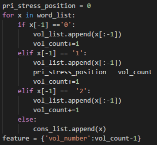
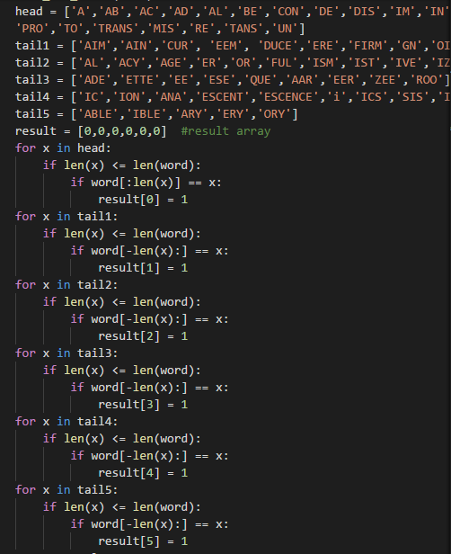
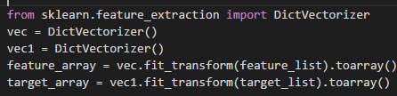
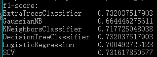
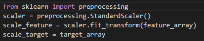
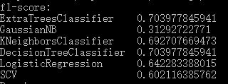
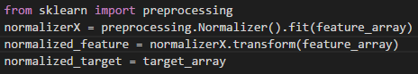
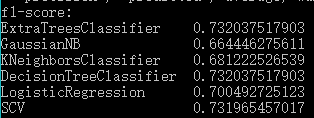
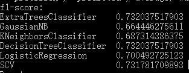
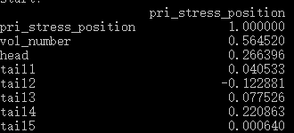

# 
Predict Stress in English Words 实验报告

### 一、小组成员

* 15331261 屈了飞
* 15331407 张应鸿
* 15331117 黄楠绚

### 二、特征值的选取

* 选取特征值
    + 在网上查找英语重音规律的相关资料后，筛选出在训练中能够用到的特征主要有：
        
        1. 依靠单词前后缀判断重音位置，主要筛选出以下一类前缀和五类后缀，分别作为6个特征，这几类前后缀会对重度位置产生影响：
            
            * 带有a, ab,ac, ad, al, be, con, de, dis em en, im, in, ,for, pre, pro, to, trans, mis, re, tans, un前缀的单词重音通常在第二音节上

            * 带aim, ain, cur, eem, duce, ere , firm, gn ,oin ,oke, ose, pt, rce, self, ume后缀的双音节词，重音通常在第二音节上

            * 重音位置与原词重音位置一样的词缀：al, acy, age, er, or,ful, ism, ist, ive, ize, ise, less, ly, ness, ship, ing, able, ry, ty

            * 重音落到最后的词缀：ade, ette, ee, ese, que, aar, eer, zee, roo

            * 某些后缀改变了原词性导致重音向后拉一个音节：形容词后缀ic,名词后缀ion, ana, escence, escent, i, ics，itis,sis,id intrepid insipid

            * 弱读的后缀ible,able,ary,ery,ory

        2. 音节数对重音也有影响：3个以下音节的单词，重读在第一音节上；3个或以上音节的单词，重读在倒数第三个音节上。因此把音节数作为一个特征

* 提取特征值

    + 读入训练集数据后，判断每个单词的音节数量：

        

        并判断是否具有某类前后缀，以1和0来标记有无：
        
        

        最后再把提取的特征转换成向量：

        

* 选取模型并进行训练：
    
    + 我们选择把f1-score作为判断模型好坏的标准。由于我们主要是需要得到较快速的数值型预测，因此选择使用树算法和逻辑回归比选择聚类算法可能会是较好选择

    + 一开始选取了ExtraTreesClassifier、DecisionTreeClassifier这两种树算法，KNeighborsClassifier，SCV向量机、贝叶斯分类器GaussianNB，以及一个线性模型LogisticRegression等模型先做初步的尝试，代码运行结果如下：

        

        从运行结果可以看到，树算法和SCV算法跑出的f1-score值比较高，并且两种树算法得出的f1-score值相同,但是分数仅仅为0.7远远达不到要求，需要做进一步改进

    + 考虑到音节数量一般都是大于等于1，为了和其他特征统一到同一个参考系下，因此对特征向量做了归一化处理

        先是对数据进行标准化处理：

        

        

        可以从运行结果中看出，所有模型的f1-score值都不同程度减少，特别是高斯贝叶斯模型的f1-score值下降程度最大，因此可以看到，不是所有的特征数据都适合做标准化处理

        再对数据进行正则化处理的尝试：

        

        

        与未处理的f1-score值比较发现，只有SCV方法与原来原来相比略有提高，且仅增加小数点后4位，几乎是没有什么成效，因此正则化数据基本没有什么作用

    + 对模型的优化主要先放在提高特征向量的质量上，继续查找资料丰富各类别的前后缀，但是f1-score几乎没有提高。再次查找资料，了解到样本数多有利于拟合，因此把已有的样本数复制一次再训练，可以看到f1-score也是几乎没有提高

        

        小组成员讨论之后，认为存在由于某些特征与音节数关系影响不大而使f1-score值不高的可能，于是先做了各个特征与目标的相关性计算：读取训练集的feature和target后存入文件中，再从文件以dataframe形式读取，并计算相关性corr值：
​        
        

        可以看到第1，3，5类后缀和重音位置关联很小，我们将这3类后缀分别去掉再次运行，得到的f1-score值仍旧不理想。

* 优化：