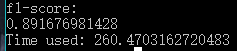
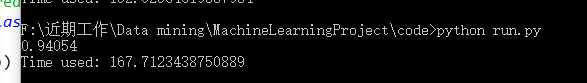
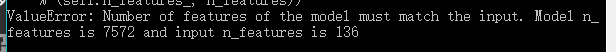
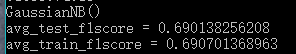
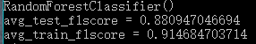
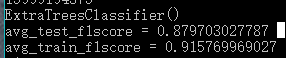
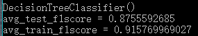
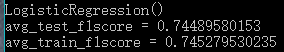
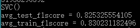

# 
Predict Stress in English Words 实验报告

### 一、小组成员

* 15331261 屈了飞
* 15331407 张应鸿
* 15331117 黄楠绚

### 二、特征值和模型的选取

* 选取特征值
    + 在网上查找英语重音规律的相关资料后，筛选出在训练中能够用到的特征主要有：
        
        1. 依靠单词前后缀判断重音位置，主要筛选出以下一类前缀和五类后缀，分别作为6个特征，这几类前后缀会对重度位置产生影响：
            
            * 带有a, ab,ac, ad, al, be, con, de, dis em en, im, in, ,for, pre, pro, to, trans, mis, re, tans, un前缀的单词重音通常在第二音节上

            * 带aim, ain, cur, eem, duce, ere , firm, gn ,oin ,oke, ose, pt, rce, self, ume后缀的双音节词，重音通常在第二音节上

            * 重音位置与原词重音位置一样的词缀：al, acy, age, er, or,ful, ism, ist, ive, ize, ise, less, ly, ness, ship, ing, able, ry, ty

            * 重音落到最后的词缀：ade, ette, ee, ese, que, aar, eer, zee, roo

            * 某些后缀改变了原词性导致重音向后拉一个音节：形容词后缀ic,名词后缀ion, ana, escence, escent, i, ics，itis,sis,id intrepid insipid

            * 弱读的后缀ible,able,ary,ery,ory

        2. 音节数对重音也有影响：3个以下音节的单词，重读在第一音节上；3个或以上音节的单词，重读在倒数第三个音节上。由于音节数一般等于元音数，把元音数也作为一个特征

* 提取特征值

    + 读入训练集数据后，判断每个单词的音节数量：

        

        并判断是否具有某类前后缀，以1和0来标记有无：
        
        

        最后再把提取的特征转换成向量：

        

* 选取模型并进行训练：
    
    + 我们选择把f1-score作为判断模型好坏的标准。由于我们主要是需要得到较快速的数值型预测，因此选择使用树算法和逻辑回归比选择聚类算法可能会是较好选择。另外，测试集样本只有4个，数量极少，因此我们训练采用训练集，计算得到模型好坏判断f1-score值也是暂时先使用训练集

    + 一开始选取了ExtraTreesClassifier、DecisionTreeClassifier这两种树算法，KNeighborsClassifier，SCV向量机、贝叶斯分类器GaussianNB，以及一个线性模型LogisticRegression等模型先做初步的尝试，代码运行结果如下：

        

        从运行结果可以看到，树算法和SCV算法跑出的f1-score值比较高，并且两种树算法得出的f1-score值相同,但是分数仅仅为0.7远远达不到要求，需要做进一步改进

    + 考虑到音节数量一般都是大于等于1，为了和其他特征统一到同一个参考系下，对特征向量做了归一化处理

        先是对数据进行标准化处理：

        

        

        可以从运行结果中看出，所有模型的f1-score值都不同程度减少，特别是高斯贝叶斯模型的f1-score值下降程度最大，可以看到，不是所有的特征数据都适合做标准化处理

        再对数据进行正则化处理的尝试：

        

        

        与未处理的f1-score值比较发现，只有SCV方法与原来原来相比略有提高，且仅增加小数点后4位，几乎是没有什么成效，所以正则化数据对我们实验基本没有太多帮助

    + 对模型的优化主要先放在提高特征向量的质量上，继续查找资料丰富各类别的前后缀，但是f1-score几乎没有提高。再次查找资料，了解到样本数多有利于拟合，我们把已有的样本数复制一次再训练，可以看到f1-score也是几乎没有提高

        

        小组成员讨论之后，认为存在由于某些特征与音节数关系影响不大而使f1-score值不高的可能，于是先做了各个特征与目标的相关性计算：读取训练集的feature和target后存入文件中，再从文件以dataframe形式读取，并计算相关性corr值：
​        
        

        由运行结果可知，第1，3，5类后缀和重音位置关联很小，我们将这3类后缀分别去掉再次运行，得到的f1-score值仍旧不理想。

### 三、优化及遇到的问题

* 对提取特征的方式进一步优化：

    + 最后我们组员在网上查阅了一篇讲述了单词子字符串与重音位置关联的论文，文中举了个例子：cryer,dryer,fryer都有相同的子字符串ry-er，该特定的子字符串与重音模式匹配，此类具有相同结构的单词的重音位置也必然是相同的。我们决定在提取特征时进一步优化，不是之前的简单将元音数作为特征，而是把单词的所有元音都作为特征，由于作业要求单词元音数最多有4个，因此可以取4个位置作为向量，从训练集中举个例子：
        
        将 “posi” 作为第 i 元音，若该单词无第i个元音，则为False,
        
        * eg: COED:K OW1 EH2 D

            'pos0': 'OW', 'pos1': 'EH', 'pos2': False, 'pos3': False, 'pos4': False 重音位置：0

        * 两个单词的子字符串结构相同，音节结构和重音位置相同的例子:

            + CRYER:K R AY1 ER0

                'pos0': 'AY', 'pos1': 'ER', 'pos2': False, 'pos3': False, 'pos4': False  重音位置:0

            + FRYER:F R AY1 ER0

                'pos0': 'AY', 'pos1': 'ER', 'pos2': False, 'pos3': False, 'pos4': False 重音位置:0

    + 提取出特征向量后，我们先采用逻辑回归模型进行测试，并且由于使用该方法选择和提取特征后，程序运行时占用内存较大，且运行时间较长，为防止超出限制时间，我们添加了计时器作为观察。使用逻辑回归模型进行尝试的结果：

        

        可以看到运行f1-score提高大大提高，并且运行时间也远小于限制时间，再经过组员的努力尝试，最后发现RandomForest分类器跑出的分数最高：

        

        由运行结果可知，在我们直接采用训练集fit和计算f1-score时可以达到了0.94左右，采用优化的方法进步飞快。

* 优化过程中遇到的问题及解决方案

    + 由于采用训练集训练有可能会出现过度拟合，并且用训练的数据计算f1-score会导致f1-score偏高，于是我们决定采用k-fold交叉验证来计算出更合理的f1-score。
    
        但是经过尝试后我们发现，由于提取特征的方法，导致特征向量长度过长，采用k-fold交叉验证跑程序会出现内存爆了跑不动的情况。
    
        最后我们先人工写代码拆分训练集进行分别的训练和测试算出f1-score，结果程序在运行过程中出现报错：

        

        报错原因是我们训练集和测试集的向量长度不一致。经过分析，我们发现，向量长度不一致原因仍在于提取特征的方法，导致特征向量长度与数据实际内容相关，因此训练集和测试集的内容不同，会导致向量长度不一致。
        
        经过组员们的讨论和尝试后，我们改进了提取特征的方法，假设目前总共有m个元音，把m个元音存进list，如果list第i个元音存在于单词音节中，则该特征对应的值为该元音在单词元音的下标，否则对应的值为-1。
        
        改进了提取特征方法后，特征向量长度固定且变短了，运行时内存占用率没那么高，且运行时间也大大缩短。经过组员运行测试，f1-score的值比之前有所下降但仍能达到0.91左右。
        
    + 改进了提取特征方法后，程序也允许用k-fold交叉验证跑出更合理的f1-score。我们组员写了循环跑多个模型得到f1-score，将k-fold的n_splits值设为10，求出每个模型在10次分割出不同的测试集和训练集中得到的10个f1-score的平均值。

        运行结果如下：

        

        

        

        

        

        

        可以看到随机森林分类器的分数是最高的，用k-fold的测试集得到的f1-score值是最高的，达到了0.88，比用训练集得到的f1-score值低，是合理的。

-------------以下内容暂定-----------------
+ 对voteclassifier的尝试？？        
    
+ ？？假设目前总共有m个元音，把m个元音存进list，特征向量的每个pos对应的值为k，k为该pos对应的元音在list的下标，且k∈[0,m-1]。

------------敬请期待更新：P----------------

### 四、实验总结和感想

* 实验总结

    （求补充QAQ）

* 实验感想

    在本次实验中我们边学边做各种尝试，为了获取单词重音的规律我们用谷歌搜索了各种资料，还有组员专门查找和阅读一些英文论文，为了熟悉sklearn的用法，上sklearn官网去看它对各类模型的介绍以及对应的用法，然后不断尝试，不断实践，遇到问题和困难，小组成员积极讨论，踊跃提出自己的想法和解决方法，一步步找到相对合适的模型。

    通过这次实验，对于数据挖掘，我们有更进一步的了解。。。。（求补充QAQ）

    最后，我们也感到组员间的交流与合理分工的重要性，由于人与人思维的差异，让组员们在交流学习中互相启发，提出不同的方法，能够发现对方没有察觉到的问题，组队比个人单干，能够学习到更多。以及合理的分工，互相协作，让我们实验中节省了不少时间。

本次作业参考资料来源：

1. 英语重音规律参考资料：http://blog.sina.com.cn/s/blog_465fff0f0100v4ji.html

2. 优化参考的论文：http://www.anthology.aclweb.org/P/P09/P09-1014.pdf
